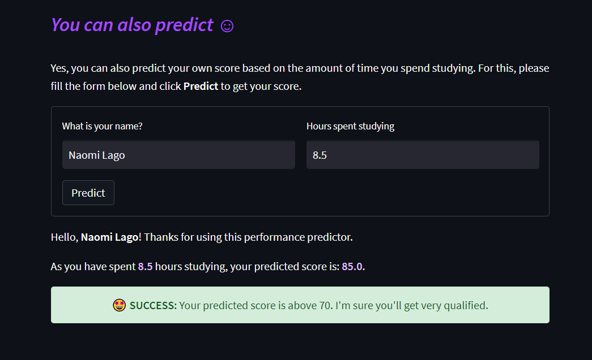

<!-- HEADER -->

<h1 align='center' style='font-weight: bold; color: #a54aff;'>Student Performance Predictor</h1>
<h5 align='center' style='color: #ddbbff;'>A Machine Learning Model to Predict Student Performance</h5>

<br><br><p style='text-align: justify'>
            I'm so excited to announce and deploy my first Machine Learning project using Linear Regression. 
            The aim here is to predict students performance based in the time studied. </p> <br>

<p align='center'>
    
</p>

<!-- INSTALATION -->

<br><h3 style='color: #a54aff;'><i>Instalation</i></h3>

In order to run this project in your own machine, use the package manager [pip](https://pip.pypa.io/en/stable/) to install the following packages:
    
```bash 
pip install plotly
pip install streamlit
```

<!-- REFERENCES -->

<br><h3 style='color: #a54aff;'><i>References</i></h3>

> For my data source, I used a Kaggle dataset provided by <a href='https://www.kaggle.com/datasets/himanshunakrani/student-study-hours'>Himanshu Nakrani</a>.

> You can also get an overview f this project in a video on my YouTube channel <a href='https://www.youtube.com'>here</a>.
